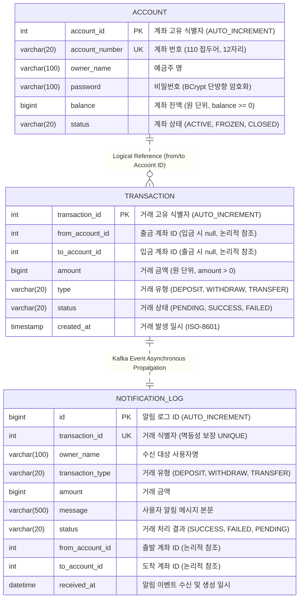

# ERD (Entity Relationship Diagram) — Fin-Account Hub

## 1. 아키텍처 및 데이터베이스 설계 원칙

본 프로젝트는 **Database per Service (서비스별 독립 데이터베이스)** 패턴을 엄격하게 준수합니다.
각 마이크로서비스는 자체 데이터베이스(스키마)를 독점적으로 소유하며, 타 서비스의 데이터베이스에 직접 접근(Direct Query/Join)할 수 없습니다. 서비스 간 데이터 연계 및 동기화는 오직 **동기 API(OpenFeign)** 또는 **비동기 이벤트(Kafka + Schema Registry)**를 통해서만 이루어집니다.

```
┌─────────────────────────┐       ┌───────────────────────────┐       ┌─────────────────────────────┐
│     account-service     │       │    transaction-service    │       │     notification-service    │
│  (포트: 동적 / lb)      │       │   (포트: 동적 / lb)       │       │   (포트: 8085 / lb)         │
└───────────┬─────────────┘       └─────────────┬─────────────┘       └──────────────┬──────────────┘
            │                                   │                                    │
            ▼                                   ▼                                    ▼
   ┌─────────────────┐                 ┌─────────────────┐                  ┌─────────────────┐
   │    accountdb    │                 │  transactiondb  │                  │  notificationdb │
   │   (MariaDB 1)   │                 │   (MariaDB 2)   │                  │   (MariaDB 3)   │
   └─────────────────┘                 └─────────────────┘                  └─────────────────┘
```

---

## 2. 전체 논리 ER 다이어그램 (Mermaid)



---

## 3. 서비스별 상세 테이블 명세

### 3.1 Account Service (`accountdb`)

**테이블명: `account` (계좌 원장)**

| 컬럼명 | 데이터 타입 | 제약 조건 | 기본값 | 설명 |
|---|---|---|---|---|
| `account_id` | `INT` | PK, AUTO_INCREMENT | - | 계좌 내부 고유 식별자 |
| `account_number` | `VARCHAR(20)` | UNIQUE, NOT NULL | - | 고객 대면용 12자리 계좌번호 (`110` + 난수 9자리) |
| `owner_name` | `VARCHAR(100)` | NOT NULL | - | 예금주 성명 |
| `password` | `VARCHAR(100)` | NOT NULL | - | 계좌 인증 비밀번호 (BCrypt Hashing) |
| `balance` | `BIGINT` | NOT NULL | `0` | 계좌 잔액 (원 단위, 음수 차감 불가) |
| `status` | `VARCHAR(20)` | NOT NULL | `'ACTIVE'` | 계좌 상태 (`ACTIVE`: 정상, `FROZEN`: 동결, `CLOSED`: 해지) |

- **인덱스**:
  - `PRIMARY KEY (account_id)`
  - `UNIQUE INDEX uq_account_number (account_number)`

---

### 3.2 Transaction Service (`transactiondb`)

**테이블명: `transaction` (거래 내역)**

| 컬럼명 | 데이터 타입 | 제약 조건 | 기본값 | 설명 |
|---|---|---|---|---|
| `transaction_id` | `INT` | PK, AUTO_INCREMENT | - | 거래 트랜잭션 고유 ID |
| `from_account_id` | `INT` | NULLABLE | `NULL` | 출금 계좌 ID (`DEPOSIT` 시 `NULL`, `WITHDRAW`/`TRANSFER` 시 필수) |
| `to_account_id` | `INT` | NULLABLE | `NULL` | 입금 계좌 ID (`WITHDRAW` 시 `NULL`, `DEPOSIT`/`TRANSFER` 시 필수) |
| `amount` | `BIGINT` | NOT NULL | - | 거래 금액 (1원 이상) |
| `type` | `VARCHAR(20)` | NOT NULL | - | 거래 구분 (`DEPOSIT`, `WITHDRAW`, `TRANSFER`) |
| `status` | `VARCHAR(20)` | NOT NULL | `'PENDING'` | 트랜잭션 상태 (`PENDING`: 처리중, `SUCCESS`: 성공, `FAILED`: 실패) |
| `created_at` | `TIMESTAMP` | NOT NULL | `CURRENT_TIMESTAMP` | 거래 요청 시각 |

- **인덱스**:
  - `PRIMARY KEY (transaction_id)`
  - `INDEX idx_from_account (from_account_id)`
  - `INDEX idx_to_account (to_account_id)`

---

### 3.3 Notification Service (`notificationdb`)

**테이블명: `notification_log` (알림 이력)**

| 컬럼명 | 데이터 타입 | 제약 조건 | 기본값 | 설명 |
|---|---|---|---|---|
| `id` | `BIGINT` | PK, AUTO_INCREMENT | - | 알림 로그 고유 식별자 |
| `transaction_id` | `INT` | UNIQUE, NOT NULL | - | 거래 고유 ID (Kafka 중복 수신 방지 및 멱등성 보장) |
| `owner_name` | `VARCHAR(100)` | NOT NULL | - | 알림 수신 대상 예금주 명 |
| `transaction_type` | `VARCHAR(20)` | NOT NULL | - | 거래 구분 (`DEPOSIT`, `WITHDRAW`, `TRANSFER`) |
| `amount` | `BIGINT` | NOT NULL | - | 거래 금액 |
| `message` | `VARCHAR(500)` | NOT NULL | - | 포맷팅된 사용자 대면 알림 메시지 |
| `status` | `VARCHAR(20)` | NOT NULL | `'SUCCESS'` | 거래 최종 상태 (`SUCCESS`, `FAILED`, `PENDING`) |
| `from_account_id` | `INT` | NULLABLE | `NULL` | 출금 계좌 ID |
| `to_account_id` | `INT` | NULLABLE | `NULL` | 입금 계좌 ID |
| `received_at` | `DATETIME` | NOT NULL | `CURRENT_TIMESTAMP` | 알림 수신 및 저장 시각 |

- **인덱스**:
  - `PRIMARY KEY (id)`
  - `UNIQUE INDEX uq_notification_tx_id (transaction_id)`
  - `INDEX idx_owner_received (owner_name, received_at DESC)`

---

## 4. 분산 데이터 일관성 및 동기화 메커니즘

1. **서비스 간 물리적 FK 제거**:
   - `transaction` 및 `notification_log` 테이블은 `account_id`를 물리 외래키(Foreign Key)로 참조하지 않고, 논리적 식별자로만 관리합니다.
   - 이를 통해 특정 서비스 DB 장애 시 타 서비스 DB로의 장애 전파(Cascading Failure)를 원천 차단합니다.

2. **Saga 보상 트랜잭션을 통한 잔액 정합성 보장**:
   - 이체(`TRANSFER`) 수행 시:
     - 1단계: `from_account_id` 계좌 잔액 차감 (`updateAccountForWithdraw`)
     - 2단계: `to_account_id` 계좌 잔액 증액 (`updateAccountForDeposit`)
     - 실패 처리: 2단계 실패 시 `compensateWithdraw()`를 호출하여 1단계에서 차감된 금액을 `from_account_id`로 즉시 재입금(환불).
     - 트랜잭션 기록: `transaction` 테이블에 `FAILED` 상태 기록.

3. **Avro + Schema Registry 기반 비동기 데이터 전달**:
   - 거래 완료 시 `TransactionEvent` Avro 스키마 기반 바이너리 직렬화 후 `fin.transaction.events` 토픽으로 발행.
   - `notification-service`는 컨슈머 레벨에서 `transaction_id` 기반 중복 체크(멱등성)를 수행한 뒤 `notification_log`에 영속화.
